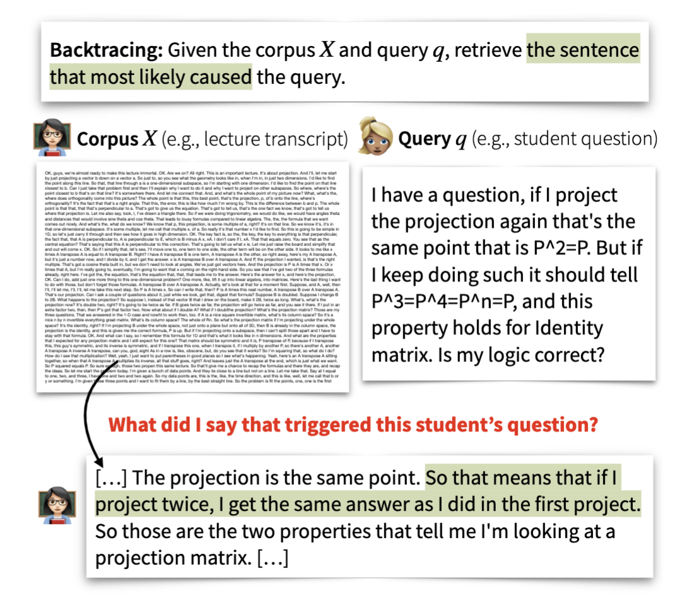

# Backtracing: Retrieving the Cause of the Query

<p align="center" style="font-size: 1.5em;">
    <a href="https://arxiv.org/pdf/2403.03956.pdf">Paper</a> •
    <a href="https://huggingface.co/datasets/rose-e-wang/backtracing">HuggingFace</a> •
    <a href="https://youtu.be/hjkFp4q9urA?si=-eioSFi-W89oJM8R">Video</a> •
    <a href="#citation">Citation</a>
</p>


**Authors:** Rose E. Wang, Pawan Wirawarn, Omar Khattab, Noah Goodman, Dorottya Demszky

Findings of EACL, Long Paper, 2024.

## What is Backtracing?



Many online content portals allow users to ask questions to supplement their understanding (e.g., of lectures or news articles). 
While information retrieval (IR) systems may provide answers for such user queries, they do not directly assist content creators identify segments that _caused_ a user to ask those questions; this can be useful for several purposes like helping improve their content.
We introduce the task of **backtracing**, in which systems retrieve the text segment that most likely provoked a user query.

## This Repository

In this repository, you will find: 

1. The first **benchmark for backtracing**, composed of three heterogeneous datasets and causal retrieval tasks: understanding the cause of (a) student confusion in the _Lecture_ domain, (b) reader curiosity  in the _News Article_ domain, and (c) user emotion in the _Conversation_ domain.
2. **Evaluations of a suite of retrieval systems on backtracing**, including: BM25, bi-encoder methods, cross-encoder methods, re-ranker methods, gpt-3.5-turbo-16k, and several likelihood-based methods that use pre-trained language models to estimate the probability of the query conditioned on variations of the corpus. 

Our results reveal several limitations of these methods; for example, bi-encoder methods struggle when the query and target segment share limited similarity and likelihood-based methods struggle with modeling what may be unknown information to a user. Overall, these results suggest that Backtracing is a challenging task that requires new retrieval approaches.

We hope our benchmark serves to evaluate and improve future retrieval systems for Backtracing, and ultimately, spawns systems that empower content creators to understand user queries, refine their content and provide users with better experiences.

## Citation

If you find our work useful or interesting, please consider citing it! 

```
@inproceedings{wang2024backtracing,
  title = {Backtracing: Retrieving the Cause of the Query},
  booktitle = {Findings of the Association for Computational Linguistics: EACL 2024},
  publisher = {Association for Computational Linguistics},
  year = {2024},
  author = {Wang, Rose E. and Wirawarn, Pawan and Khattab, Omar and Goodman, Noah and Demszky, Dorottya},
}
```

## Reproducibility 

We ran our experiments with Python 3.11 and on A6000 machines. To reproduce the results in our work, please run the following commands:

```
>> conda create -n backtracing python=3.11
>> conda activate backtracing 
>> pip install -r requirements.txt # install all of our requirements
>> source run_table_evaluations.sh
```

`run_table_evaluations.sh` outputs text files under `results/<dataset>/`. The text files contain the results reported in Table 2 and 3. Here is an example of what the result should look like: 

```
>> cat results/sight/semantic_similarity.txt
Query dirs: ['data/sight/query/annotated']
Source dirs: ['data/sight/sources/annotated']
Output fname: results/sight/annotated/semantic_similarity.csv
Output fname: results/sight/annotated/semantic_similarity.csv
Accuracy top 1: 0.23
Min distance top 1: 91.85
Accuracy top 3: 0.37
Min distance top 3: 35.22
```

## Dataset Structure


The datasets are located under the `data` directory. 
Each dataset contains the `query` directory (e.g., student question) and the `sources` directory (e.g., the lecture transcript sentences).

```
└── data                # Backtracing Datasets
    └── sight           # Lecture Domain, SIGHT, derived from https://github.com/rosewang2008/sight
        ├── query
        └── sources
    └── inquisitive     # News Article Domain, Inquisitive, derived from https://github.com/wjko2/INQUISITIVE
        ├── query
        └── sources
    └── reccon          # Conversation Domain, RECCON, derived from https://github.com/declare-lab/RECCON 
        ├── query                   
        └── sources 
```


## Retrieving from scratch

The section above uses the cached scores. If you want to run the retrieval from scratch, then run: 


```
>> export OPENAI_API_KEY='yourkey' # if you want to run the gpt-3.5-turbo-16k results as well. otherwise skip. 
>> source run_inference.sh
```

